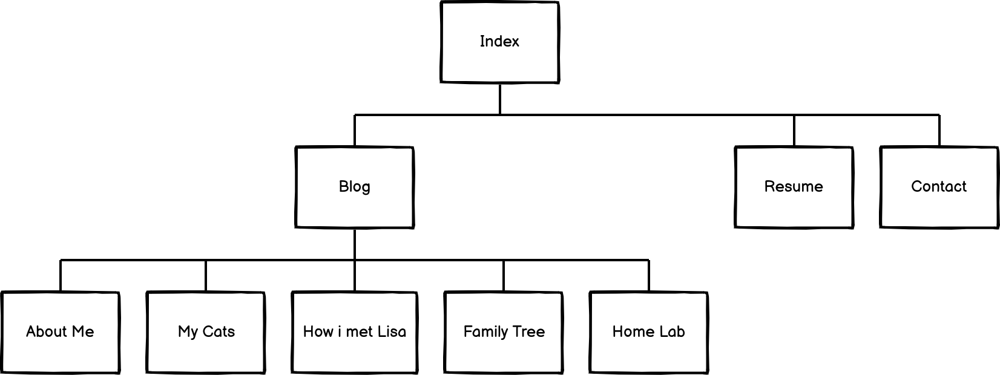
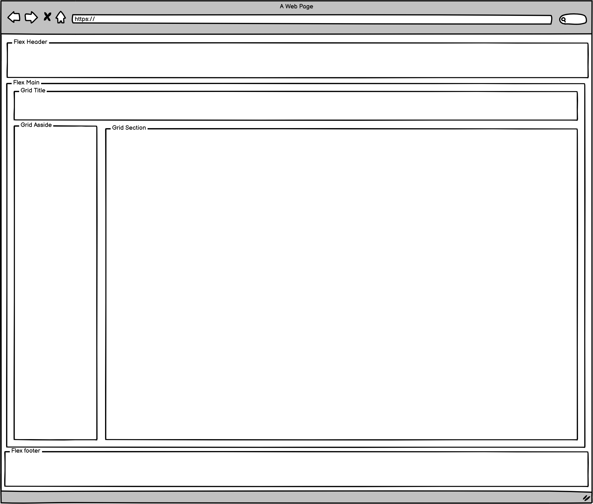
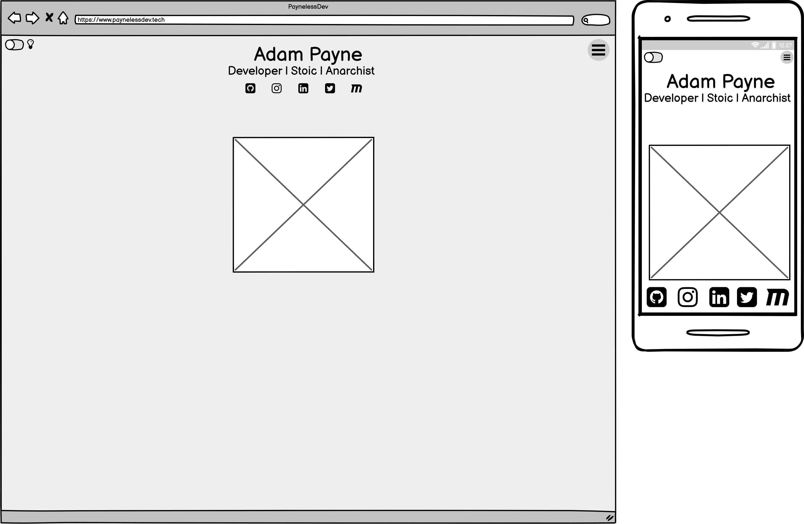
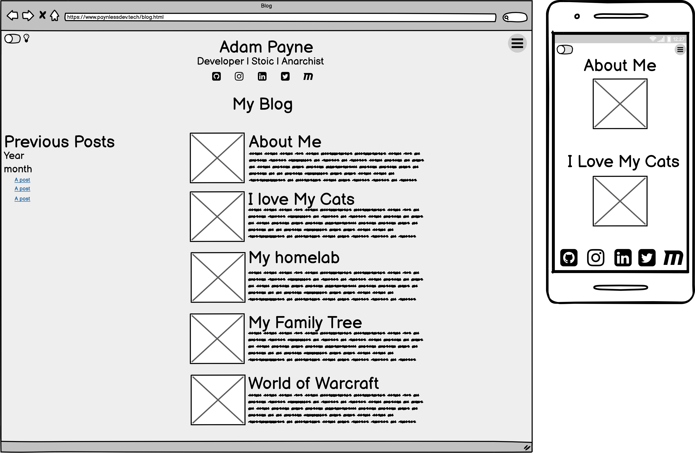
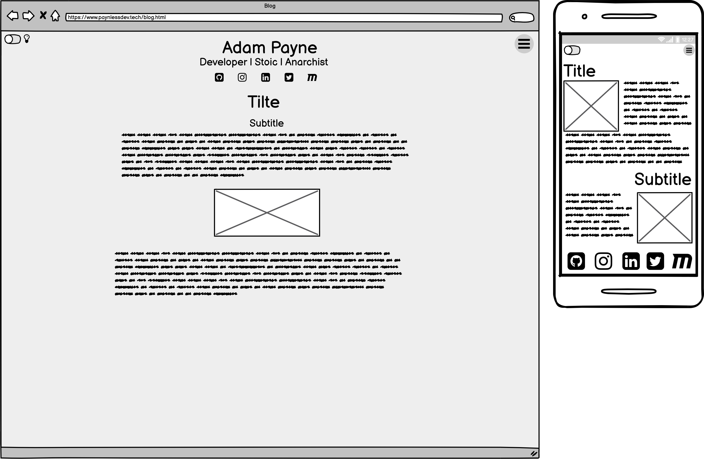
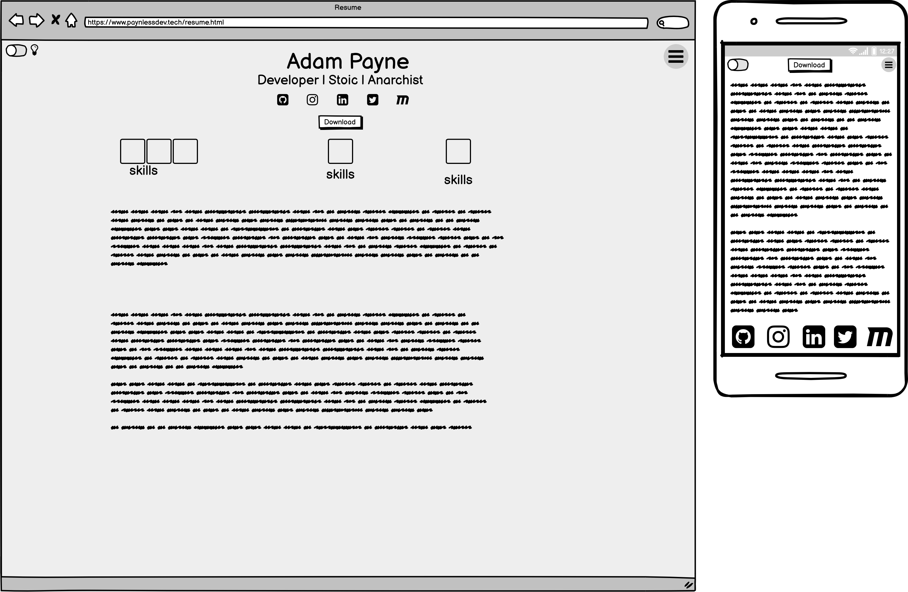
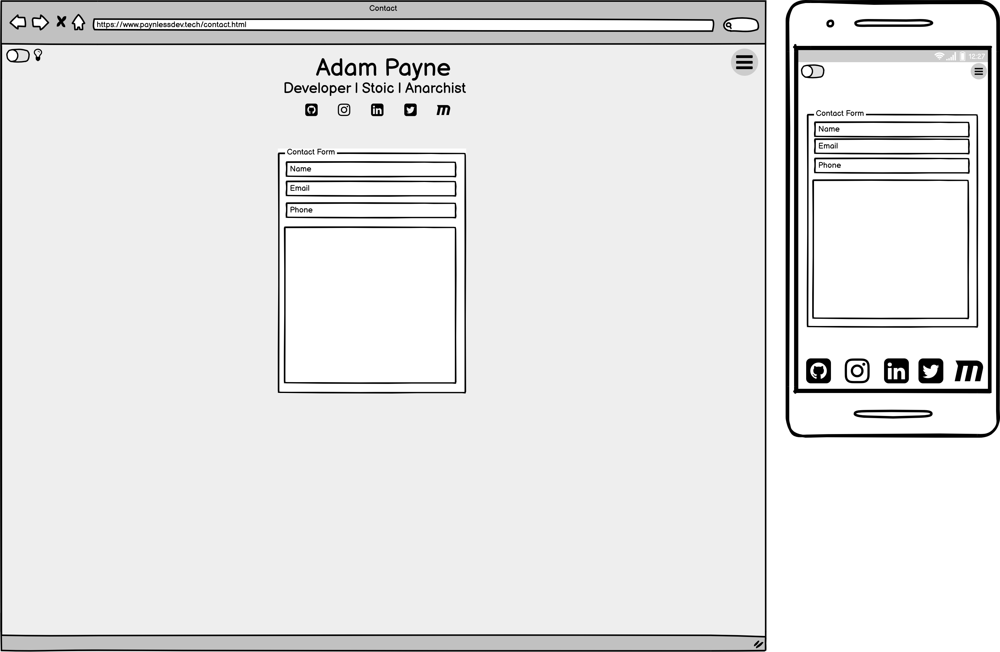
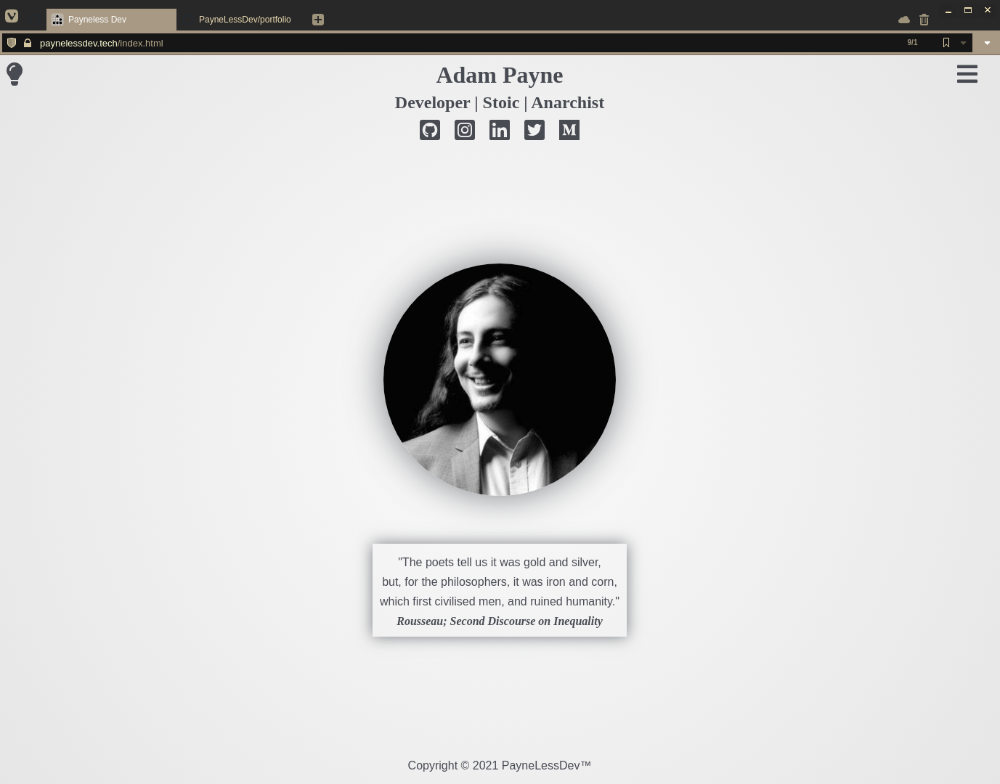
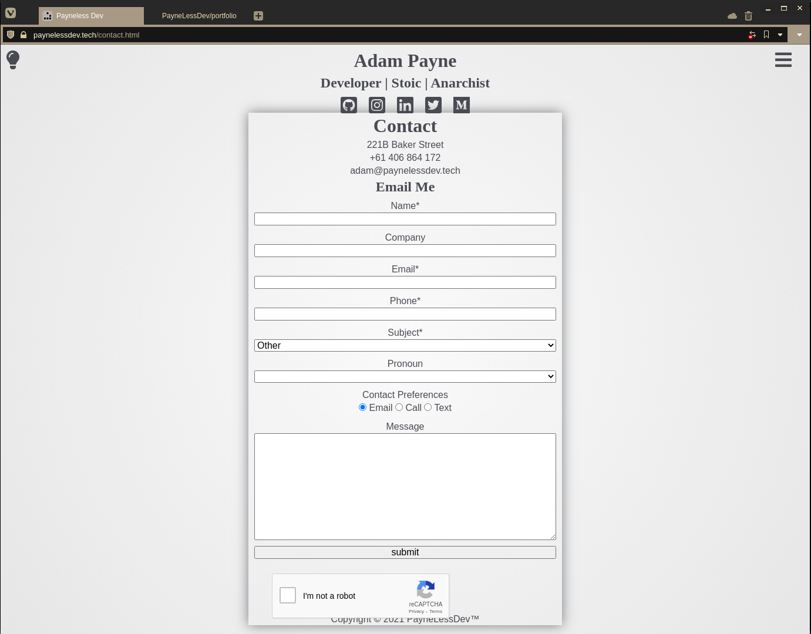

# T1A2 - Portfolio
URL: [Portfolio](https://www.paynelessdev.tech) | Repo: [Github](https://github.com/PayneLessDev/portfolio) | 

## Purpose

Completeing this bootcamp is the first step in the wed developer career.

In order to have sucsess in my job search its important to have a proffesional portfolio website,

this website will show off the relevent skills and knowledeg i have aquired to perefctive employeers.

## Functions and Features

## Site Map
Here is the sitemap with all the html documents and their relationship to each other.

## Wireframes
### Layout

### Index

### Blog

### Blog Post

### Resume

### Contact

## Screenshot
### Index

### Blog

### Blog Post

### Resume

### Contact

## Target Audience

## Tech Stack
* [HTML boilerplate](https://html5boilerplate.com); for folder structure and defaults for css and html

* GIT and Github; for local and remote version controll

* HTML5, CSS3 & Javascript; the actual languages used

* Netlify; Continous intergration and Deployment platform

* Wireframes done with balsamiq

* Slide deck created with google sheets

* Domain purchased through get.tech

* check dotfiles repo for editor and terminal configs
