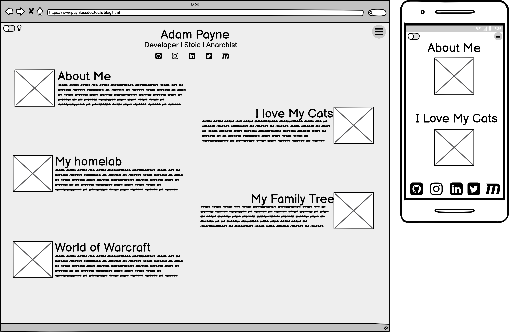

# T1A2 - Portfolio
URL: [Portfolio](https://optimistic-varahamihira-178b69.netlify.app) | Repo: [Github](https://github.com/PayneLessDev/portfolio)

##Purpose##
Completeing this bootcamp is the first step in the wed developer career.

In order to have sucsess in my job search its important to have a proffesional portfolio website,

this website will show off the relevent skills and knowledeg i have aquired to perefctive employeers.

##Functions and Features##

##Site Map##
Here is the sitemap with all the html documents and their relationship to each other.

##Wireframes##
Here is an example of some of the wireframes produced for this project.

##Screenshot##

##Target Audience##

##Tech Stack##

